# fNIRS QC Visualization Analysis

Goal: keep the code compact while producing detailed QC visualizations for each `.bin` / Homer2 `.nirs` file.

Included views:
1. Dataset structure and acquisition summary
2. Raw intensity overview
3. Full-channel heatmaps and signal distributions
4. SCI scalp-coupling quality
5. Bad-channel marking
6. Motion artifact detection
7. Stimulus and Aux channels
8. Cross-run summary comparison

## 1. Imports and Data Loading

```
Project root: /Users/chunyu/Documents/GitHub/PSYFNIRS
Loaded 3 files
Sub-0 | 20230424_0053_03.bin | 120,600 samples x 70 channels
Sub-0 | 20230424_0549_01.bin | 73,500 samples x 70 channels
Sub-1 | 20230424_0053_03.bin | 120,600 samples x 70 channels
```

## 2. Compact QC Helper Functions

## 3. Dataset Summary Table

```
subject                  file  duration_min  sfreq  samples  channels  \
0   Sub-0  20230424_0053_03.bin     40.199667   50.0   120600        70   
1   Sub-0  20230424_0549_01.bin     24.499667   50.0    73500        70   
2   Sub-1  20230424_0053_03.bin     40.199667   50.0   120600        70   

   SD_pairs  SCI_good_pairs  SCI_mean  bad_channels  motion_%  stim_channels  \
0        35              21  0.632424            28  0.000000              1   
1        35               3  0.171783            64  1.600022              1   
2        35              21  0.632424            28  0.000000              1   

   aux_channels  
0             8  
1             8  
2             8
```

## 4. Overview: Duration, SCI, Bad Channels, Motion

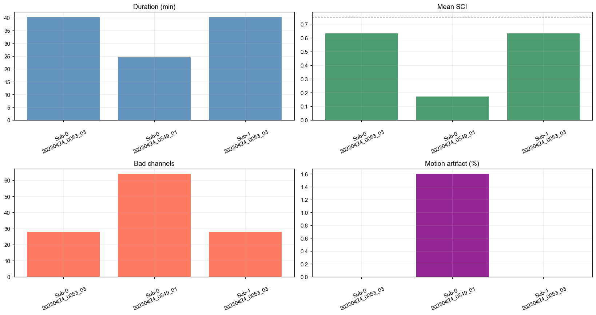

## 5. Raw Intensity Stack: First 120 Seconds

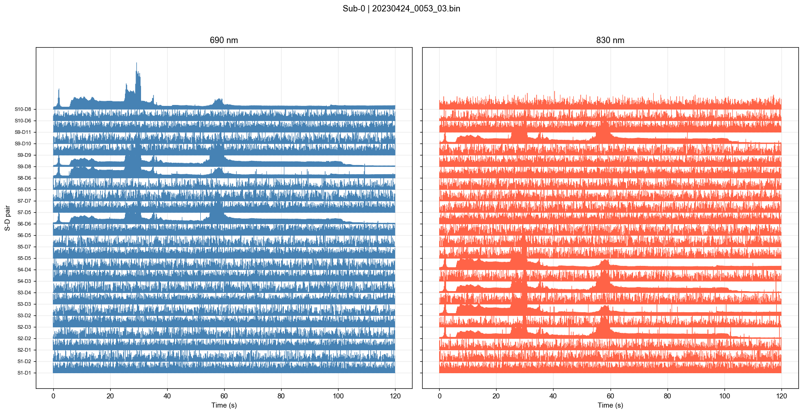

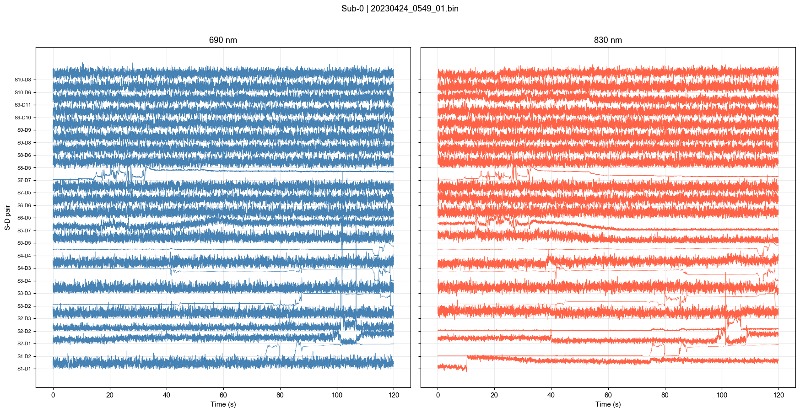


## 6. Full-Channel Heatmaps: Drift, Dropouts, Saturation

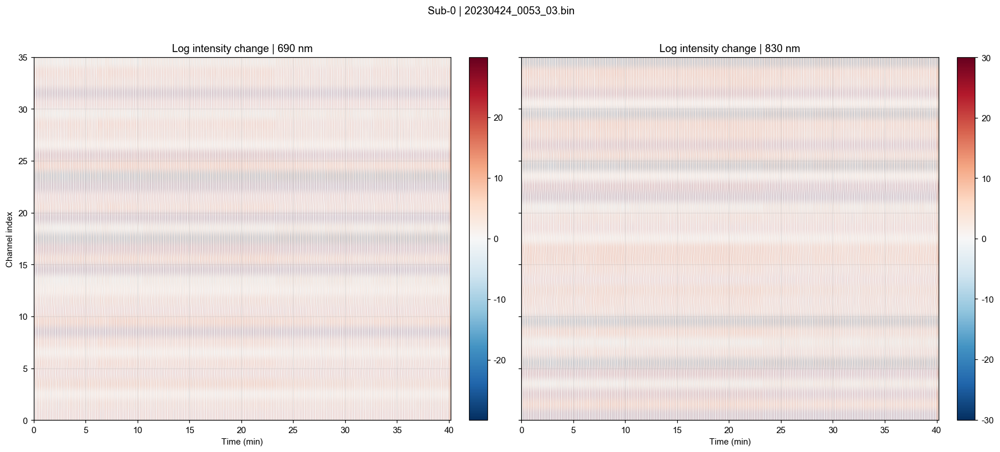

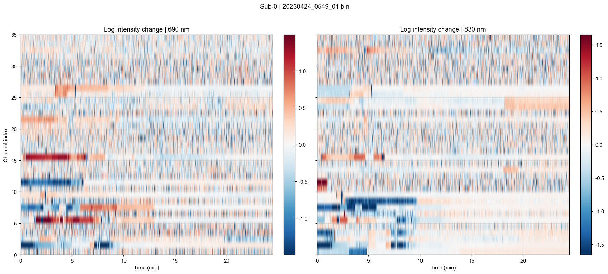

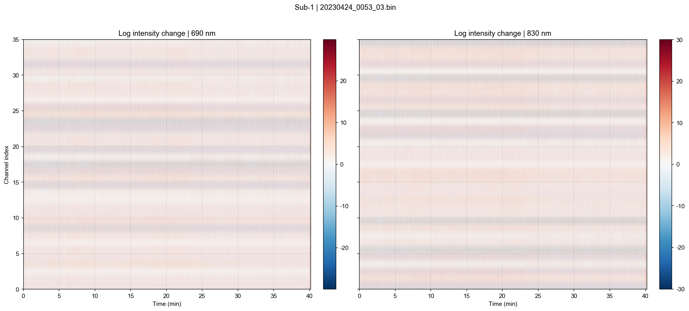

## 7. Signal Distribution: Per-Channel Intensity Range

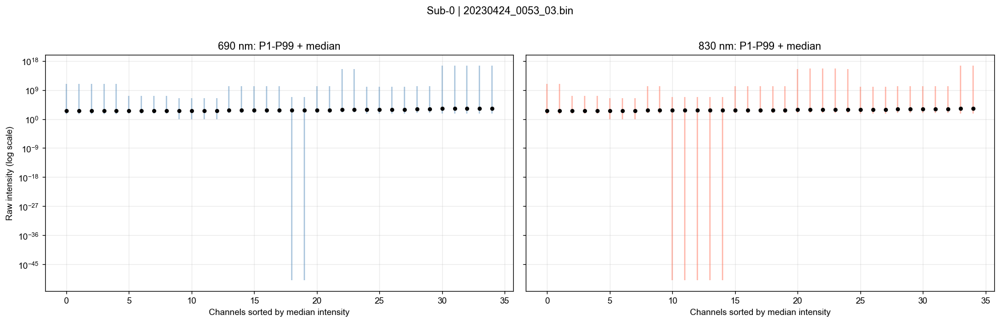

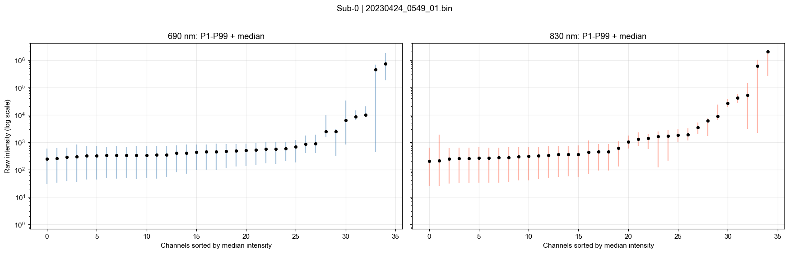


## 8. SCI: Scalp Coupling Quality


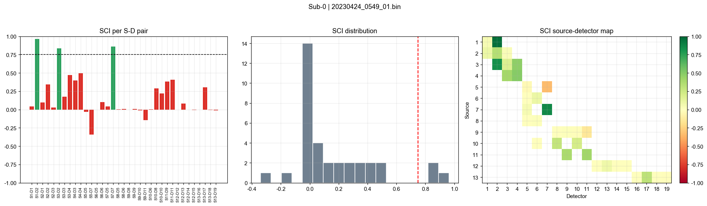

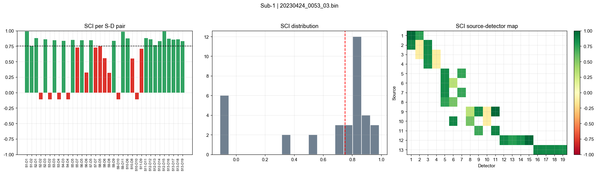

## 9. Bad-Channel Table and Plot

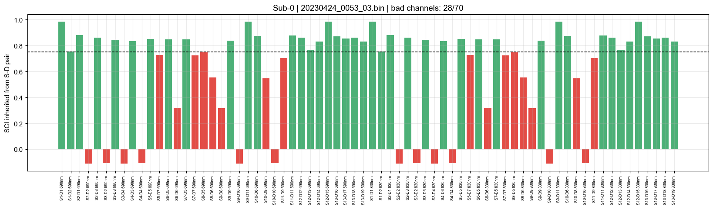

```
label       SCI  peak_to_peak     reason
0     S2-D2 690nm -0.111008  1.412538e+10  SCI=-0.11
1     S3-D2 690nm -0.108115  1.584893e+10  SCI=-0.11
2     S3-D4 690nm -0.110579  1.584893e+10  SCI=-0.11
3     S4-D4 690nm -0.107818  1.412538e+10  SCI=-0.11
4     S5-D7 690nm  0.728303  1.122018e+10   SCI=0.73
5     S6-D6 690nm  0.322085  2.583277e+06   SCI=0.32
6     S7-D7 690nm  0.725899  1.412538e+10   SCI=0.73
7     S8-D5 690nm  0.746326  3.162278e+15   SCI=0.75
8     S8-D6 690nm  0.553096  7.735837e+06   SCI=0.55
9     S9-D8 690nm  0.318455  2.581397e+06   SCI=0.32
10   S9-D10 690nm -0.110629  1.584893e+10  SCI=-0.11
11   S10-D8 690nm  0.548032  7.733487e+06   SCI=0.55
12  S10-D10 690nm -0.108027  1.412538e+10  SCI=-0.11
13   S11-D9 690nm  0.705425  3.162278e+15   SCI=0.71
14    S2-D2 830nm -0.111008  2.579836e+06  SCI=-0.11
15    S3-D2 830nm -0.108115  7.730592e+06  SCI=-0.11
16    S3-D4 830nm -0.110579  2.581105e+06  SCI=-0.11
17    S4-D4 830nm -0.107818  7.724229e+06  SCI=-0.11
18    S5-D7 830nm  0.728303  1.584893e+10   SCI=0.73
19    S6-D6 830nm  0.322085  7.079458e+10   SCI=0.32
20    S7-D7 830nm  0.725899  1.412538e+10   SCI=0.73
21    S8-D5 830nm  0.746326  1.412538e+10   SCI=0.75
22    S8-D6 830nm  0.553096  1.412533e+07   SCI=0.55
23    S9-D8 830nm  0.318455  7.079458e+10   SCI=0.32
24   S9-D10 830nm -0.110629  2.580512e+06  SCI=-0.11
25   S10-D8 830nm  0.548032  1.412533e+07   SCI=0.55
26  S10-D10 830nm -0.108027  7.732515e+06  SCI=-0.11
27   S11-D9 830nm  0.705425  1.412538e+10   SCI=0.71
```

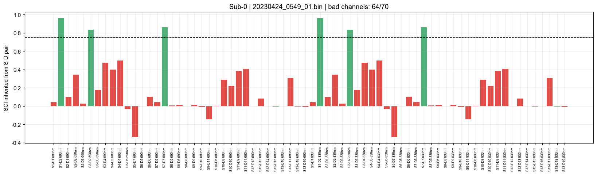

```
label       SCI  peak_to_peak     reason
0     S1-D1 690nm  0.041783    670.007540   SCI=0.04
1     S2-D1 690nm  0.098845   1011.429881   SCI=0.10
2     S2-D2 690nm  0.343485    789.075155   SCI=0.34
3     S2-D3 690nm  0.026795    572.449046   SCI=0.03
4     S3-D3 690nm  0.177669    554.496651   SCI=0.18
..            ...       ...           ...        ...
59  S12-D15 830nm -0.006422    579.307542  SCI=-0.01
60  S13-D16 830nm -0.001613    592.532399  SCI=-0.00
61  S13-D17 830nm  0.305828   1076.019714   SCI=0.31
62  S13-D18 830nm -0.007363    602.547942  SCI=-0.01
63  S13-D19 830nm -0.009238    594.702207  SCI=-0.01

[64 rows x 4 columns]
```


```
label       SCI  peak_to_peak     reason
0     S2-D2 690nm -0.111008  1.412538e+10  SCI=-0.11
1     S3-D2 690nm -0.108115  1.584893e+10  SCI=-0.11
2     S3-D4 690nm -0.110579  1.584893e+10  SCI=-0.11
3     S4-D4 690nm -0.107818  1.412538e+10  SCI=-0.11
4     S5-D7 690nm  0.728303  1.122018e+10   SCI=0.73
5     S6-D6 690nm  0.322085  2.583277e+06   SCI=0.32
6     S7-D7 690nm  0.725899  1.412538e+10   SCI=0.73
7     S8-D5 690nm  0.746326  3.162278e+15   SCI=0.75
8     S8-D6 690nm  0.553096  7.735837e+06   SCI=0.55
9     S9-D8 690nm  0.318455  2.581397e+06   SCI=0.32
10   S9-D10 690nm -0.110629  1.584893e+10  SCI=-0.11
11   S10-D8 690nm  0.548032  7.733487e+06   SCI=0.55
12  S10-D10 690nm -0.108027  1.412538e+10  SCI=-0.11
13   S11-D9 690nm  0.705425  3.162278e+15   SCI=0.71
14    S2-D2 830nm -0.111008  2.579836e+06  SCI=-0.11
15    S3-D2 830nm -0.108115  7.730592e+06  SCI=-0.11
16    S3-D4 830nm -0.110579  2.581105e+06  SCI=-0.11
17    S4-D4 830nm -0.107818  7.724229e+06  SCI=-0.11
18    S5-D7 830nm  0.728303  1.584893e+10   SCI=0.73
19    S6-D6 830nm  0.322085  7.079458e+10   SCI=0.32
20    S7-D7 830nm  0.725899  1.412538e+10   SCI=0.73
21    S8-D5 830nm  0.746326  1.412538e+10   SCI=0.75
22    S8-D6 830nm  0.553096  1.412533e+07   SCI=0.55
23    S9-D8 830nm  0.318455  7.079458e+10   SCI=0.32
24   S9-D10 830nm -0.110629  2.580512e+06  SCI=-0.11
25   S10-D8 830nm  0.548032  1.412533e+07   SCI=0.55
26  S10-D10 830nm -0.108027  7.732515e+06  SCI=-0.11
27   S11-D9 830nm  0.705425  1.412538e+10   SCI=0.71
```

## 10. Motion Artifacts: Score Timeline + Heatmap Overlay

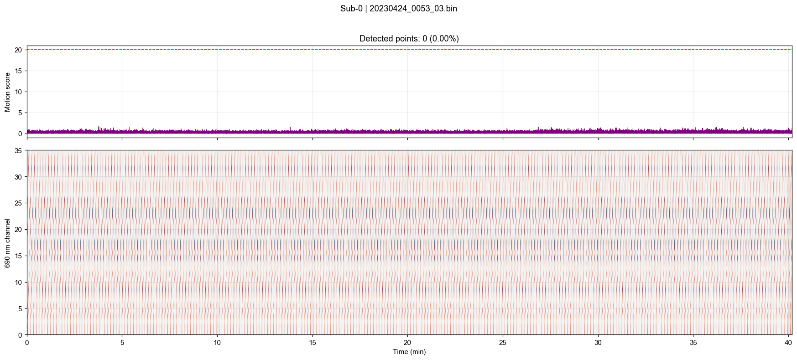

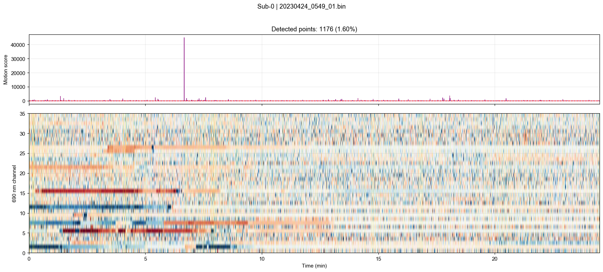

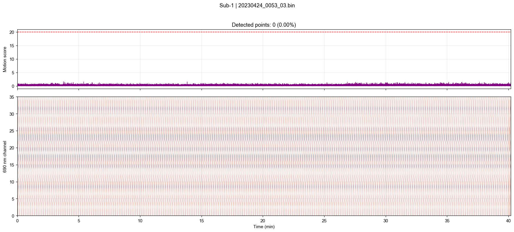

## 11. Stimulus and Aux Channels


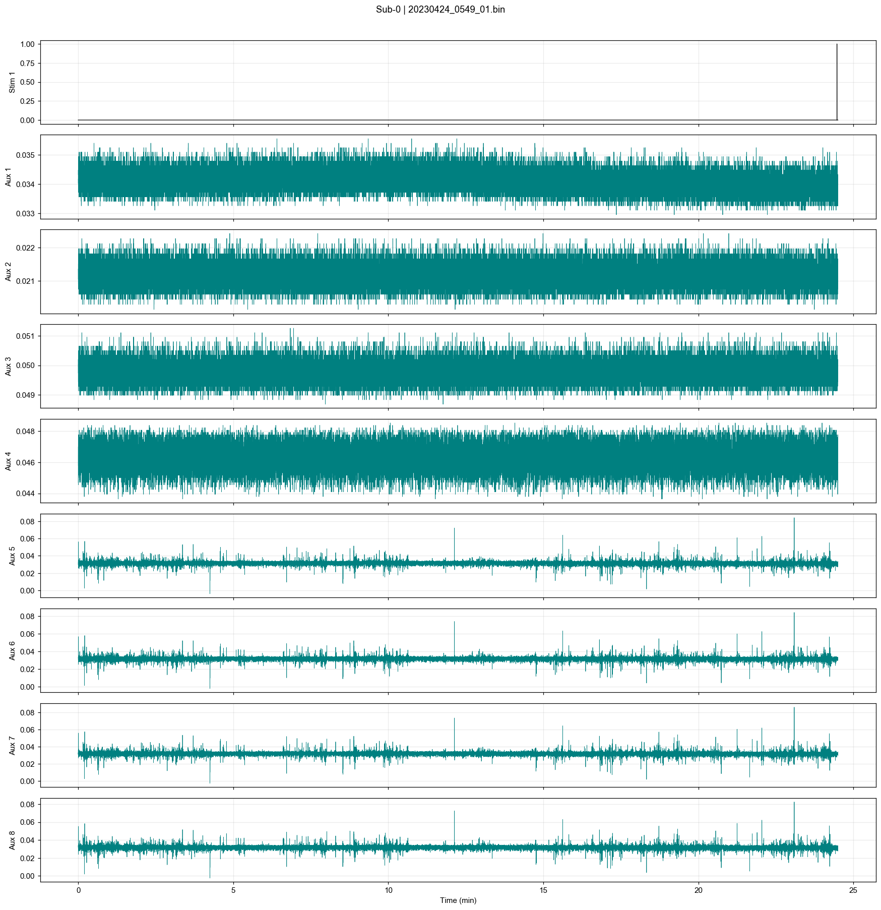

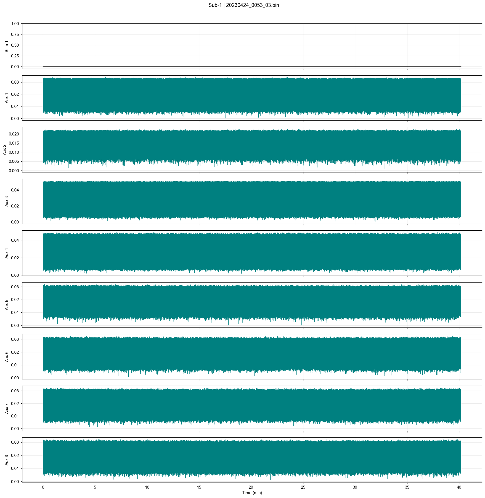

## 12. QC Notes Per Run

```
subject                  file  duration_min  SCI_good_%  SCI_mean  \
0   Sub-0  20230424_0053_03.bin     40.199667   60.000000  0.632424   
1   Sub-0  20230424_0549_01.bin     24.499667    8.571429  0.171783   
2   Sub-1  20230424_0053_03.bin     40.199667   60.000000  0.632424   

   bad_channels  motion_%                 quality_flag  
0            28  0.000000  usable / check bad channels  
1            64  1.600022      poor / use with caution  
2            28  0.000000  usable / check bad channels
```

## 13. 预处理流水线 — Homer2 → MNE Raw

将 Homer2 格式数据转为 MNE `RawArray`，后续所有预处理步骤均基于 MNE-NIRS 标准函数：

| 步骤 | 函数 | 说明 |
|------|------|------|
| OD 转换 | `optical_density` | 原始光强 → 光密度 |
| 运动校正 | `tddr` | Temporal Derivative Distribution Repair |
| 带通滤波 | `raw.filter` | 0.01–0.5 Hz |
| Beer-Lambert | `beer_lambert_law` | OD → HbO / HbR（μM） |

```
Sub-0 | 20230424_0053_03.bin: 70 ch @ 50 Hz, 40.2 min
Sub-0 | 20230424_0549_01.bin: 70 ch @ 50 Hz, 24.5 min
Sub-1 | 20230424_0053_03.bin: 70 ch @ 50 Hz, 40.2 min
```

## 14. Step 1 — 光密度转换 (Optical Density)

$$\text{OD}(t) = -\log\!\left(\frac{d(t)}{d_0}\right)$$

将原始光强转为光密度，消除基线水平差异，后续分析在 OD 域进行。

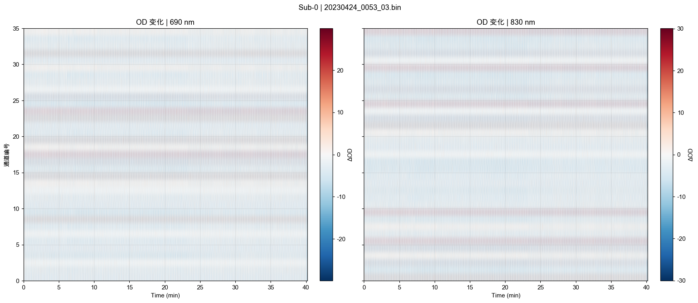

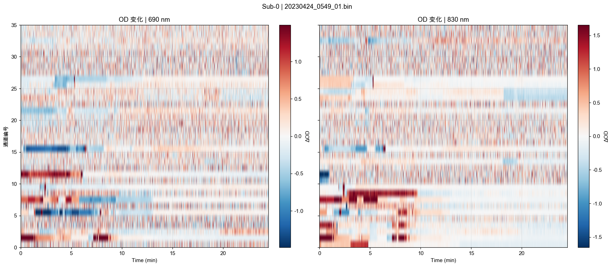


## 15. Step 2 — 运动伪迹校正 (TDDR)

**TDDR**（Temporal Derivative Distribution Repair, Fishburn et al. 2018）：无需手动调参，对 OD 时间序列的一阶差分做稳健归一化，去除脉冲式运动伪迹。

以质量最差的 run（Sub-0, 0549）对比校正前后效果。

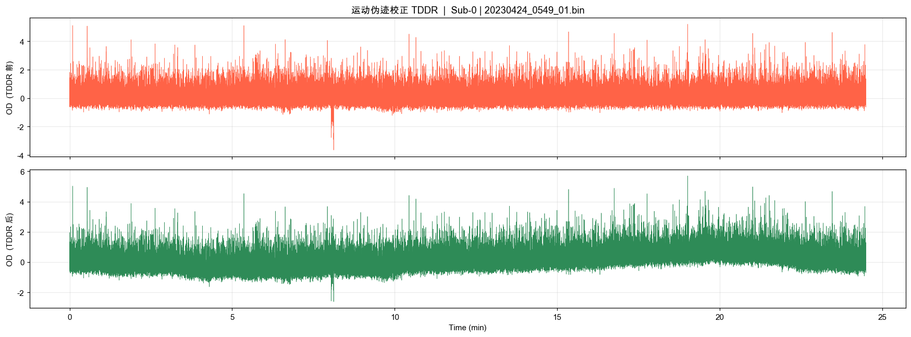

## 16. Step 3 — 带通滤波 (0.01–0.5 Hz)

- **高通 0.01 Hz**：去除慢漂移（呼吸、血压低频振荡、基线偏移）
- **低通 0.5 Hz**：保留血动响应频段，去除心跳（~1 Hz）等高频干扰

以功率谱密度（PSD）展示滤波前后差异。

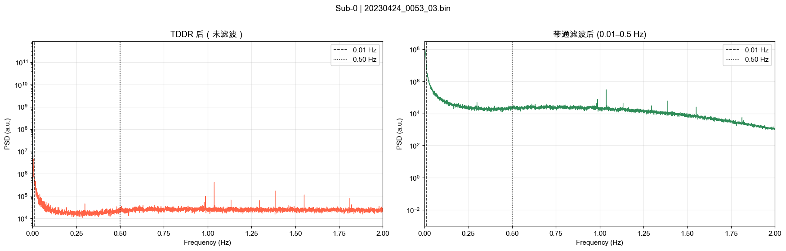

## 17. Step 4 — Beer-Lambert → HbO / HbR

修正 Beer-Lambert 定律将 OD 变化转换为血红蛋白浓度变化（μM）：

$$\Delta[\text{HbX}] = \frac{\Delta\text{OD}}{\varepsilon_{\text{HbX}} \cdot \text{DPF} \cdot L}$$

- `ppf=6.0`：成人典型部分路径长度因子（DPF ≈ 6）
- SCI < 0.75 的通道标记为 bad，不用于后续分析

```
Sub-0 | 20230424_0053_03.bin: 42/70 good haemo channels
Sub-0 | 20230424_0549_01.bin: 6/70 good haemo channels
Sub-1 | 20230424_0053_03.bin: 42/70 good haemo channels
```

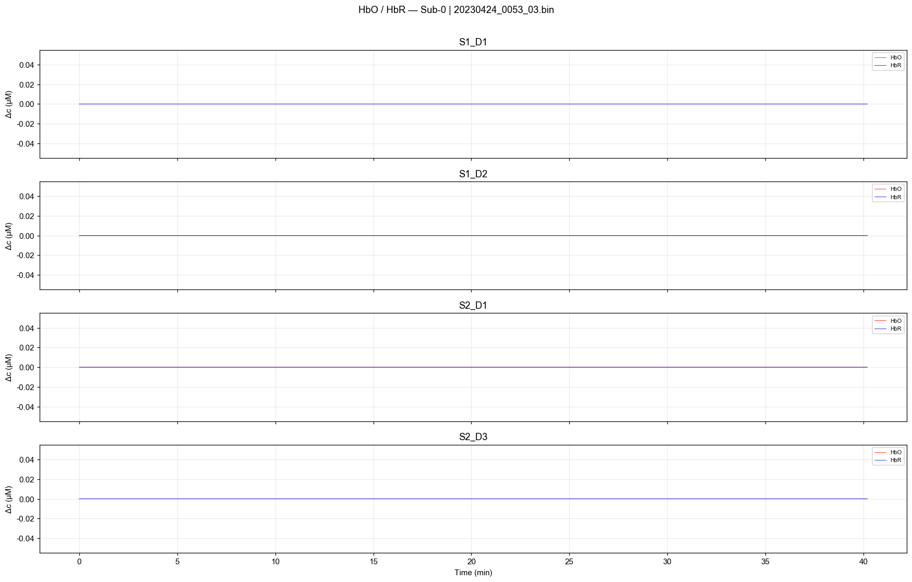

## 18. 光极布局图 — 好道 / 坏道 (Optode Layout)

将 Source-Detector 对投影到 2D 平面（Homer2 坐标，cm），连线颜色按 SCI 值着色（红=差，绿=好），直观显示哪些探头耦合不佳。


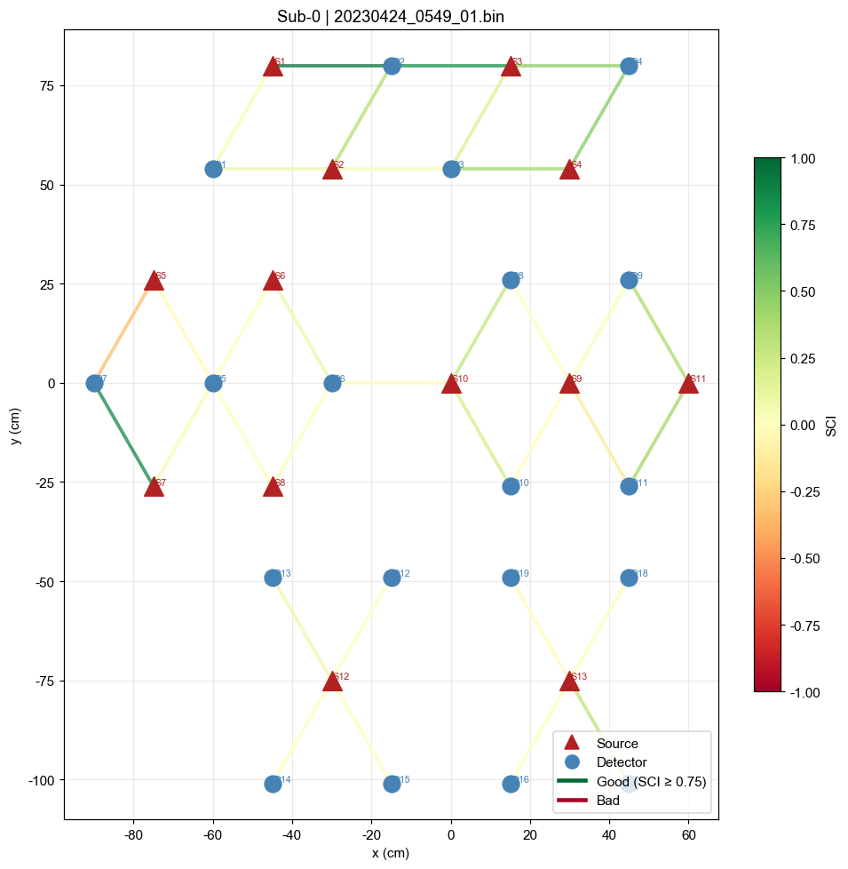

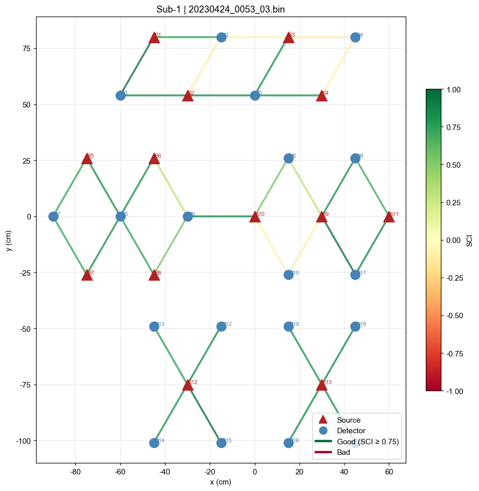

```
============================================================
Sub-0 | 20230424_0053_03.bin
  好道 (21/35): S1-D1, S1-D2, S2-D1, S2-D3, S3-D3, S4-D3, S5-D5, S6-D5, S7-D5, S9-D9, S9-D11, S10-D6, S11-D11, S12-D12, S12-D13, S12-D14, S12-D15, S13-D16, S13-D17, S13-D18, S13-D19
  坏道 (14/35): S2-D2, S3-D2, S3-D4, S4-D4, S5-D7, S6-D6, S7-D7, S8-D5, S8-D6, S9-D8, S9-D10, S10-D8, S10-D10, S11-D9

============================================================
Sub-0 | 20230424_0549_01.bin
  好道 (3/35): S1-D2, S3-D2, S7-D7
  坏道 (32/35): S1-D1, S2-D1, S2-D2, S2-D3, S3-D3, S3-D4, S4-D3, S4-D4, S5-D5, S5-D7, S6-D5, S6-D6, S7-D5, S8-D5, S8-D6, S9-D8, S9-D9, S9-D10, S9-D11, S10-D6, S10-D8, S10-D10, S11-D9, S11-D11, S12-D12, S12-D13, S12-D14, S12-D15, S13-D16, S13-D17, S13-D18, S13-D19

============================================================
Sub-1 | 20230424_0053_03.bin
  好道 (21/35): S1-D1, S1-D2, S2-D1, S2-D3, S3-D3, S4-D3, S5-D5, S6-D5, S7-D5, S9-D9, S9-D11, S10-D6, S11-D11, S12-D12, S12-D13, S12-D14, S12-D15, S13-D16, S13-D17, S13-D18, S13-D19
  坏道 (14/35): S2-D2, S3-D2, S3-D4, S4-D4, S5-D7, S6-D6, S7-D7, S8-D5, S8-D6, S9-D8, S9-D10, S10-D8, S10-D10, S11-D9
```

## 20. 数据质量总结

---

### 整体判断

| 被试 | 文件 | 可用好道 | 平均 SCI | 运动伪迹 | 建议 |
|------|------|----------|----------|----------|------|
| Sub-0 | 20230424_0053_03.bin | 21/35（60%） | 0.63 | 无 | ✅ 可用，剔除坏道后分析 |
| Sub-0 | 20230424_0549_01.bin | 3/35（9%） | 0.17 | 有（1.6%） | ❌ 质量极差，建议整个 run 排除 |
| Sub-1 | 20230424_0053_03.bin | 21/35（60%） | 0.63 | 无 | ✅ 可用，剔除坏道后分析 |

---

### Sub-0 & Sub-1 — 20230424_0053_03.bin（两人结果一致）

**好的通道（21 对，SCI ≥ 0.75）**

这些 S-D 对与头皮耦合良好，HbO/HbR 信号可信，可直接用于分析：

> S1-D1, S1-D2, S2-D1, S2-D3, S3-D3, S4-D3,
> S5-D5, S6-D5, S7-D5, S9-D9, S9-D11, S10-D6,
> S11-D11, S12-D12, S12-D13, S12-D14, S12-D15,
> S13-D16, S13-D17, S13-D18, S13-D19

**坏的通道（14 对，SCI < 0.75）**

头皮耦合差，信号受噪声污染，须在分析前剔除或插值：

> S2-D2, S3-D2, S3-D4, S4-D4, S5-D7, S6-D6,
> S7-D7, S8-D5, S8-D6, S9-D8, S9-D10, S10-D8,
> S10-D10, S11-D9

这些坏道集中在 **S3–S4、S8–S10** 附近，提示该区域探头接触可能被头发遮挡。

---

### Sub-0 — 20230424_0549_01.bin

**整个 run 不建议使用。** 原因：

- 仅 3/35 对通道信号合格（S1-D2, S3-D2, S7-D7），占比不足 10%
- 平均 SCI 仅 0.17，远低于 0.75 阈值
- 全程 1.6% 时间点检测到运动伪迹
- 时长仅 24.5 分钟（相比正常 run 的 40.2 分钟偏短），可能采集中途即出现问题

若必须使用，仅能参考以上 3 个好道，且需额外谨慎对待。

---

### 后续分析建议

1. **只用 `0053_03.bin`** — 两个被试均有该 run，质量相当，适合跨被试比较
2. **剔除 14 个坏道**（见上方列表），或用空间插值补全
3. **被试间一致性高**：Sub-0 和 Sub-1 在 0053 run 中好道/坏道完全相同，说明是系统性探头接触问题（而非个体差异），可针对性改善采集方案（加压、剃发等）
4. **0549 run 可用于对比"差质量数据"的示例**，但不应入组正式分析
